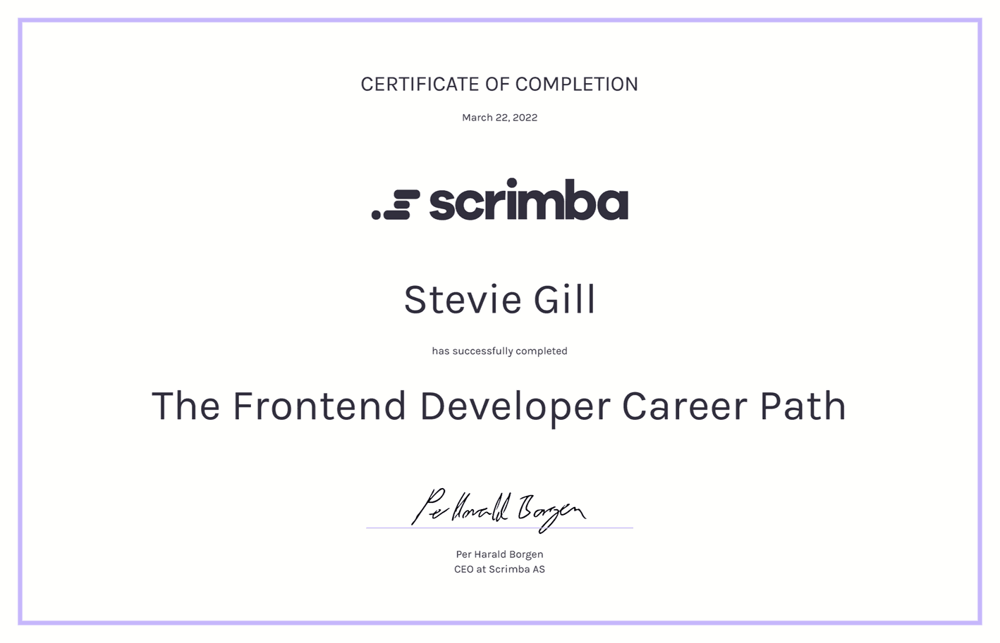
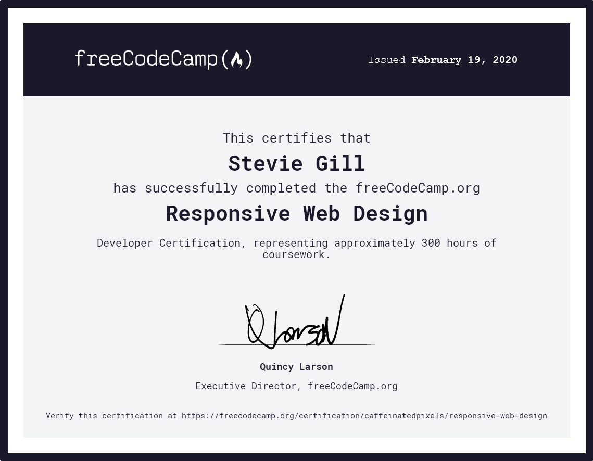
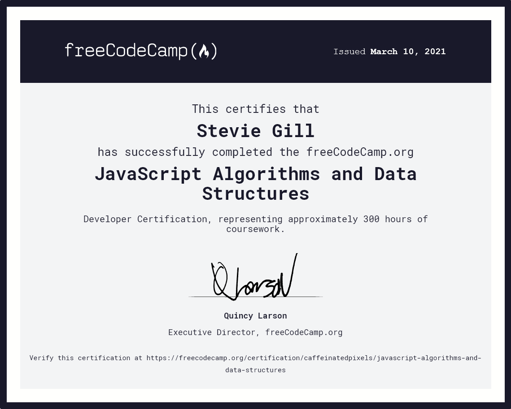
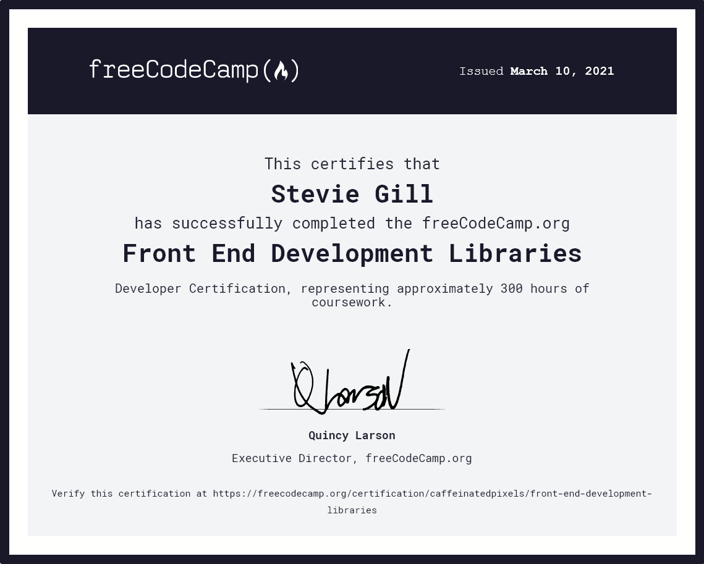

# Certificates

My frontend development certificates from Scrimba and freeCodeCamp. For larger versions see the folder or click on the links.

## Scrimba

### [Frontend Career Path](https://scrimba.com/certificate/ugGZkGsz/gfrontend)

## freeCodeCamp

### [Responsive Web Design](https://freecodecamp.org/certification/caffeinatedpixels/responsive-web-design)

### [JavaScript Algorithms and Data Structures](https://freecodecamp.org/certification/caffeinatedpixels/javascript-algorithms-and-data-structures)

### [Front End Development Libraries](https://www.freecodecamp.org/certification/caffeinatedpixels/front-end-development-libraries)

